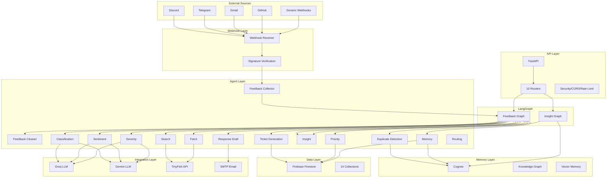
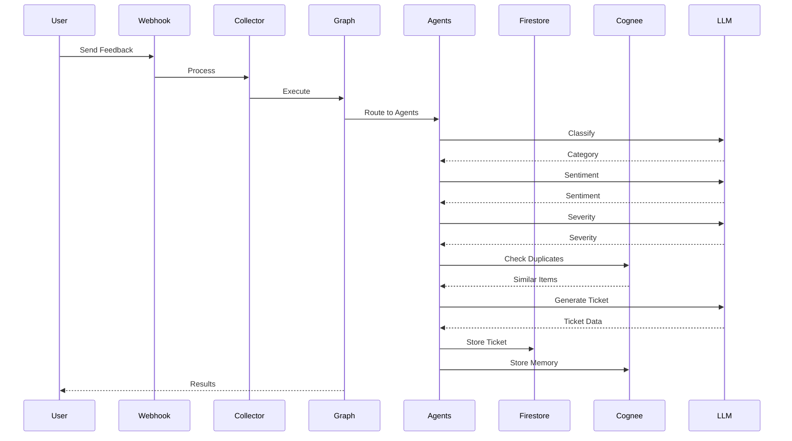
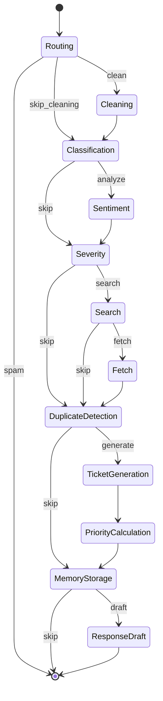
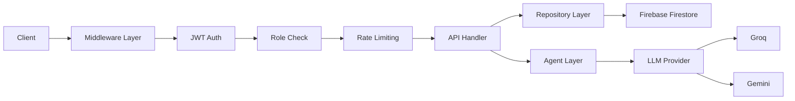
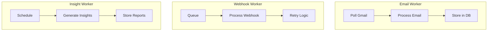
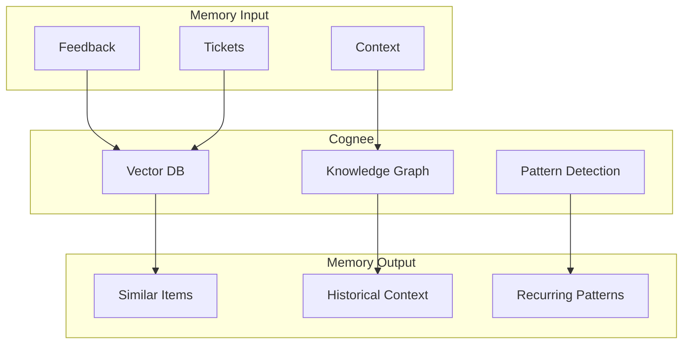
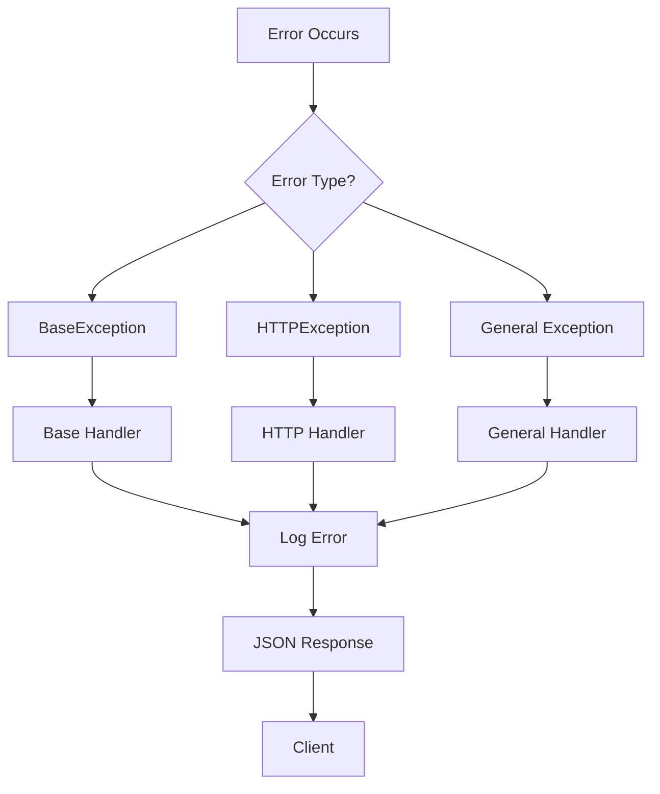
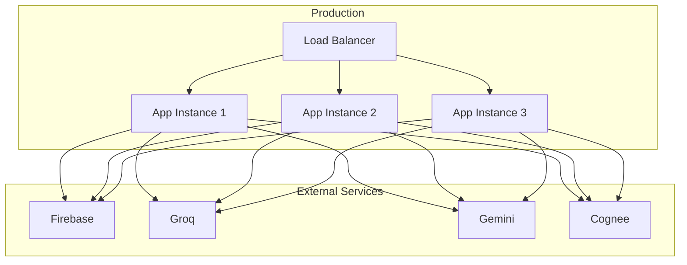

# SIDE Architecture Documentation

## System Architecture



## Database Schema

### Collections

```mermaid
erDiagram
    users ||--o{ feedback : submits
    users ||--o{ tickets : creates
    users ||--o{ ticket_updates : writes
    users ||--o{ notifications : receives
    users ||--o{ activity_logs : generates
    
    organizations ||--o{ users : has
    organizations ||--o{ feedback : receives
    organizations ||--o{ tickets : owns
    organizations ||--o{ integrations : configures
    
    customers ||--o{ feedback : provides
    customers ||--o{ messages : sends
    
    feedback ||--o|| tickets : generates
    feedback ||--o|| duplicate_clusters : belongs_to
    feedback ||--o{ agent_runs : triggers
    
    tickets ||--o{ ticket_updates : has
    tickets ||--o{ duplicate_clusters : linked_to
    tickets ||--o{ agent_runs : triggers
    
    duplicate_clusters ||--o{ feedback : contains
    duplicate_clusters ||--o|| tickets : linked_to
    
    integrations ||--o{ organizations : belongs_to
```

### Firestore Collections

1. **users** - User accounts and profiles
2. **organizations** - Organization settings
3. **feedback** - Raw feedback from all sources
4. **tickets** - Generated tickets
5. **ticket_updates** - Ticket comments and updates
6. **duplicate_clusters** - Duplicate issue clusters
7. **customers** - Customer information
8. **messages** - Message history
9. **activity_logs** - User activity tracking
10. **notifications** - User notifications
11. **integrations** - Third-party integrations
12. **agent_runs** - Agent execution logs
13. **memory** - Long-term memory storage
14. **analytics** - Analytics metrics
15. **daily_reports** - Generated reports

## Agent Flow



## LangGraph State Machine



## Security Architecture



## Background Processing



## LLM Provider Fallback

```mermaid
graph TD
    Request[Request][Request] --> Primary[Primary: Groq]
    Primary --> Success{Success?}
    Success --> Yes[Return Result]
    Success --> No[Fallback: Gemini]
    Fallback --> Success2{Success?}
    Success2 --> Yes2[Return Result]
    Success2 --> No2[Return Error]
```

## Memory Architecture



## API Versioning

All APIs are versioned under `/api/v1/`:

```
/api/v1/auth/*
/api/v1/users/*
/api/v1/organizations/*
/api/v1/feedback/*
/api/v1/tickets/*
/api/v1/webhooks/*
/api/v1/agents/*
/api/v1/integrations/*
/api/v1/dashboard/*
```

## Error Handling



## Deployment Architecture


